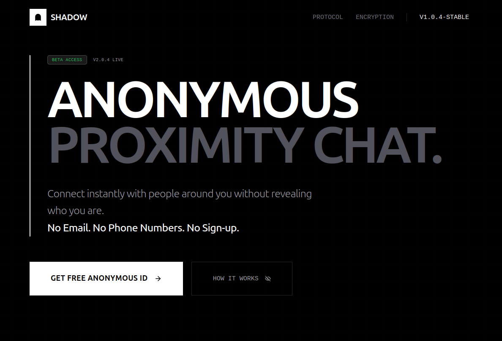

# SHADOW | Anonymous Proximity Chat
### *You are here, and so are they.*
🌍 **App:** [Live Link](https://shadow-proximatychat.netlify.app)


## 📡 Transmission Incoming...
**SHADOW** is a next-generation anonymous communication platform engineered for hyper-local interactions. It enables users to discover and join chat rooms within their immediate physical vicinity—without accounts, data tracking, or permanent records.

Built with meaningful privacy at its core, SHADOW leverages cryptographic identity generation and ephemeral data storage to ensure your conversations remain transient and secure.

---

## ⚡ Core Capabilities

- ** Zero-Knowledge Identity**: No email, phone number, or sign-up required. Your identity is a cryptographically generated session key.
- ** Geospatial Discovery**: Real-time room discovery based on your physical location (5km - 25km radius). Connect with your actual neighbors.
- ** Ephemeral Architecture**: The entire system is transient. Messages and rooms self-destruct after **24 hours**. No logs. No history.
- ** Privacy-First Design**: No user data is persisted. Location data is used strictly for proximity matching and never stored.
- ** Real-Time Sync**: Instant message delivery powered by optimized WebSocket connections.
- ** Cinematic UI**: A stunning, high-performance interface featuring dark mode, glassmorphism, and fluid animations.

---

##  The Tech Stack (Insane Engineering)

Built with a modern, scalable, and high-performance stack designed for speed and reliability.

### **Frontend Client**
- **Framework**: `Next.js 14+` (App Router, Server Actions)
- **Language**: `TypeScript` (Strict Mode)
- **Styling**: `Tailwind CSS`, `Tailwind Merge`
- **Animation**: `Framer Motion`, `Tw-animate-css`
- **State Management**: `Zustand`
- **Data Querying**: `TanStack Query (React Query)`
- **UI Components**: `Radix UI`, `Lucide React`, `Sonner` (Toast)
- **Forms**: `React Hook Form`, `Zod`

### **Backend Core Service**
- **Runtime**: `Node.js`
- **API Framework**: `Express.js`
- **Real-Time Engine**: `Socket.IO` (WebSockets)
- **Database**: `MongoDB` with `Mongoose` (GeoJSON Indexing)
- **Caching & Pub/Sub**: `Redis` (IOredis)
- **Security**: `Helmet`, `Rate-limit-redis`, `Cors`
- **Validation**: `Zod`

---

##  Architecture Highlights

### **1. Geospatial Indexing (2dsphere)**
Rooms are stored in MongoDB with **2dsphere** geospatial indexes. This allows for lightning-fast queries like `$near` and `$geoWithin` to find active chat signals within a user's specific radius.

### **2. Ephemeral Data Lifecycle (TTL)**
Every piece of data in the system has a Time-To-Live (TTL). MongoDB TTL indexes automatically purge messages and empty rooms after 24 hours. Redis keys for active user sessions expire automatically. The system cleans itself.

### **3. Cryptographic Session Management**
Instead of traditional auth, we use a session-based approach where a user's "token" is a signed JWT containing only their non-identifiable display name and a random session ID.

---

##  Getting Started

### Prerequisites
- Node.js (v18+)
- MongoDB (Running locally or Atlas URI)
- Redis (Running locally or generic provider)

### Installation

1. **Clone the repository**
   ```bash
   git clone https://github.com/yourusername/shadow.git
   cd shadow
   ```

2. **Setup Environment Variables**

   Create `.env.local` in the root:
   ```env
   NEXT_PUBLIC_API_URL=http://localhost:3000
   NEXT_PUBLIC_GEO_API_URL=https://photon.komoot.io/api
   ```

   Create `backend/.env` in the `backend` folder:
   ```env
   PORT=3000
   MONGO_URI=mongodb://localhost:27017/shadow_db
   JWT_SECRET=your_super_secret_jwt_key
   REDIS_URI=redis://localhost:6379
   FRONTEND_URL=http://localhost:3001
   ```

3. **Install Dependencies**

   **Frontend:**
   ```bash
   npm install
   ```

   **Backend:**
   ```bash
   cd backend
   npm install
   ```

4. **Run the Application**

   **Start Backend:**
   ```bash
   cd backend
   npm run dev
   ```

   **Start Frontend:**
   ```bash
   # In a new terminal, root directory
   npm run dev
   ```

5. **Access the Signal**
   Open [http://localhost:3000](http://localhost:3000) (or whichever port Next.js assigned) to begin transmission.

---

## 🤝 Contributing

Transmission is open. If you wish to improve the protocol:

1. Fork the repo
2. Create your feature branch (`git checkout -b feature/amazing-feature`)
3. Commit your changes (`git commit -m 'Add some amazing feature'`)
4. Push to the branch (`git push origin feature/amazing-feature`)
5. Open a Pull Request

---

### *Stay hidden. Stay connected.*
